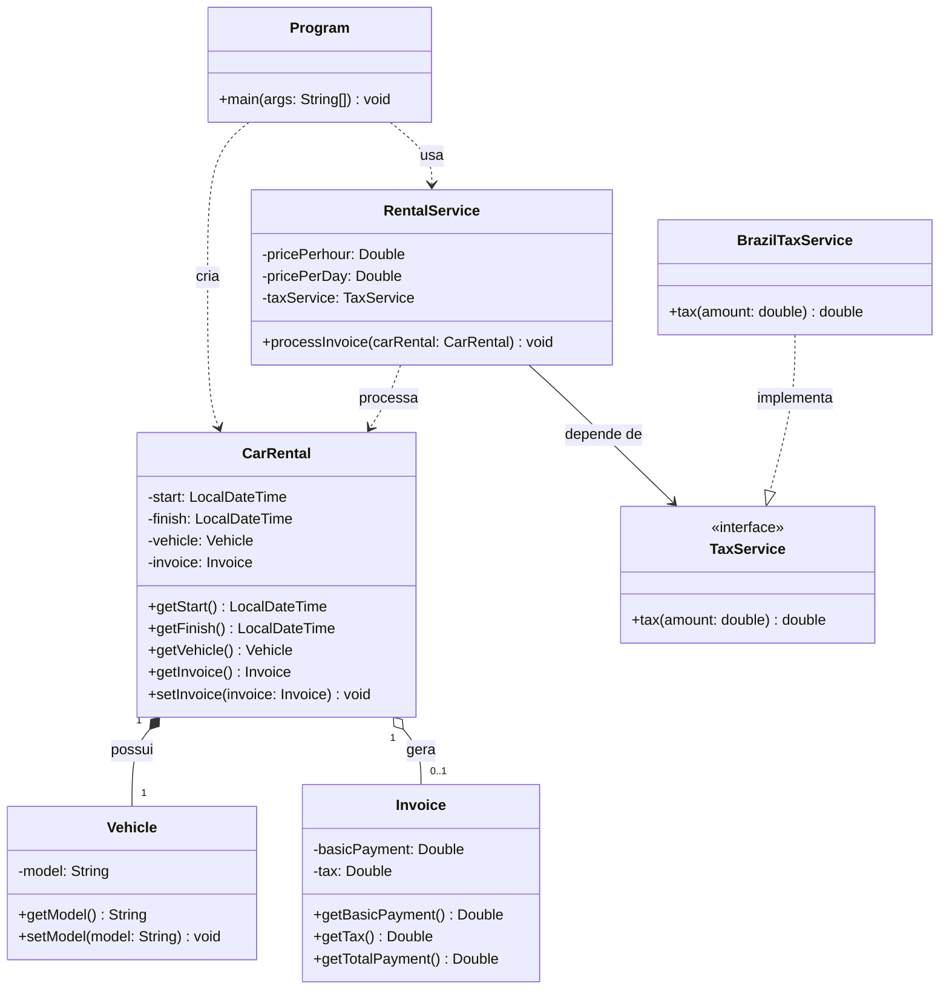

# Car Rental - Sistema de Locação de Carros

##  Sobre o Projeto

O **Car Rental** é uma aplicação de console em Java que simula o sistema de precificação de uma locadora de carros brasileira. O programa lê os dados de uma locação (modelo do veículo, data/hora de retirada e devolução, valor por hora e valor por diária) e gera automaticamente a nota de pagamento, aplicando as regras de negócio abaixo:

- Locações com duração de **até 12 horas** são cobradas por **hora cheia**.
- Locações que **ultrapassam 12 horas** passam a ser cobradas por **diária**.
- Sobre o valor da locação incide **imposto**, que varia conforme o valor total (regra fiscal brasileira simplificada).

O projeto foi construído com foco em **Programação Orientada a Objetos**, separando claramente entidades (`model.entities`) de regras de negócio (`model.services`), e usando **injeção de dependência via interface** (`TaxService`) para tornar o cálculo de imposto extensível a outros países no futuro.

## 🗂️ Diagrama de Classes



## 📁 Estrutura de Pastas

```
Car_Rental/
├── pom.xml
├── src/
│    └── main/
│        └── java/
│            └── com/
│                └── Car_Rental/
│                    ├── application/
│                    │   └── Program.java          # Ponto de entrada (main)
│                    └── model/
│                        ├── entities/
│                        │   ├── CarRental.java     # Entidade da locação
│                        │   ├── Vehicle.java       # Entidade do veículo
│                        │   └── Invoice.java       # Entidade da nota de pagamento
│                        └── services/
│                            ├── TaxService.java         # Interface de cálculo de imposto
│                            ├── BrazilTaxService.java    # Implementação da regra fiscal do Brasil
│                            └── RentalService.java       # Regra de cálculo da locação
├── pom.xml
└── README.md
```

##  Módulos

### `application`

| Classe | Responsabilidade |
|---|---|
| `Program` | Lê os dados da locação via console, orquestra o cálculo e imprime a nota de pagamento |

### `model.entities`

| Classe | Responsabilidade |
|---|---|
| `Vehicle` | Representa o modelo do carro alugado |
| `CarRental` | Representa a locação (início, fim, veículo e nota gerada) |
| `Invoice` | Representa a nota de pagamento (valor base, imposto e total) |

### `model.services`

| Classe/Interface | Responsabilidade |
|---|---|
| `TaxService` | Contrato para cálculo de imposto, permite trocar a regra fiscal por país |
| `BrazilTaxService` | Implementa a regra de imposto brasileira |
| `RentalService` | Calcula o valor da locação (hora ou diária) e gera a `Invoice` |

##  Regras de Negócio

| Regra | Descrição |
|---|---|
| Cobrança por hora | Locações com duração ≤ 12h são cobradas por hora cheia (arredondada para cima) |
| Cobrança por diária | Locações com duração > 12h são cobradas por diária (arredondada para cima) |
| Imposto reduzido | Valor da locação até R$ 100,00 → imposto de **20%** |
| Imposto padrão | Valor da locação acima de R$ 100,00 → imposto de **15%** |
| Total da nota | `Total = Valor da locação + Imposto` |

## 🛠️ Tecnologias


## ▶️ Como Executar

### Pré-requisitos

- JDK 25 (ou superior) instalado
- Maven 3.9+ instalado (ou usar o Maven embutido do IntelliJ)
- IntelliJ IDEA (Community ou Ultimate)

### Passo a passo

1. Clone o repositório:
   ```bash
   git clone https://github.com/CarlosGit-coder/Car_Rental.git
   ```
2. Abra a pasta no IntelliJ IDEA como um **projeto Maven** (o `pom.xml` será detectado automaticamente).
3. Compile e rode via Maven:
   ```bash
   mvn compile
   mvn exec:java
   ```
   Ou, dentro do IntelliJ, apenas rode a classe `Program.java` diretamente (clique direito → Run).
4. Siga as instruções no console, informando modelo do carro, datas de retirada/devolução, valor por hora e valor por diária. O programa exibirá a nota de pagamento ao final.